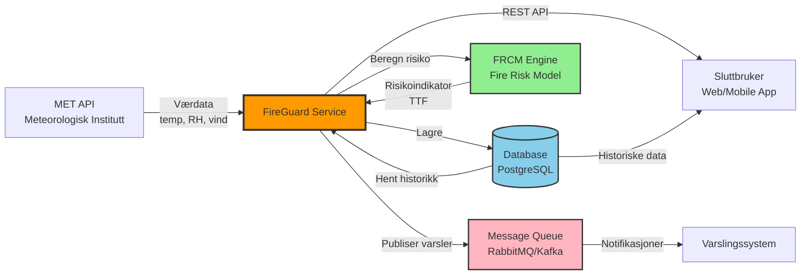
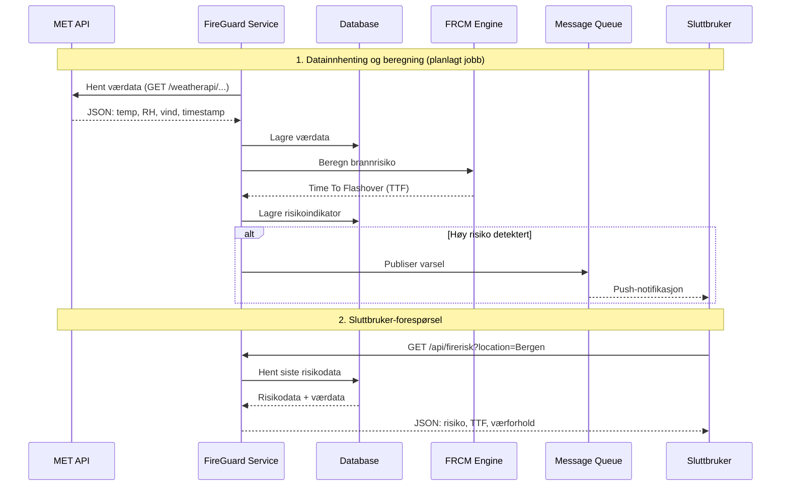
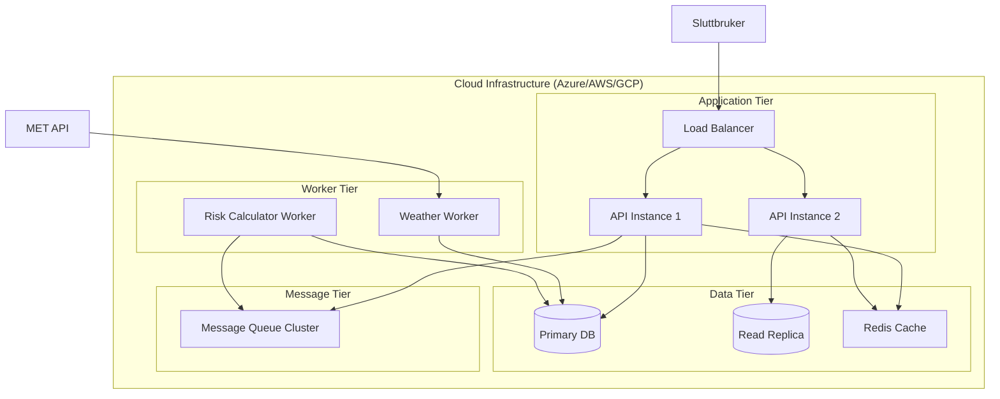

# FireGuard System Architecture

## Oversikt

FireGuard er en tjeneste for dynamisk beregning og varsling av brannrisiko for trebygninger. Systemet henter værdata fra Meteorologisk institutts API (MET API), beregner brannrisiko ved hjelp av FRCM-modellen (Fire Risk Calculation Model), og gjør resultatene tilgjengelig for sluttbrukere via et REST API.

## Systemarkitektur-diagram



## Dataflyt-diagram



## Komponenter

### 1. MET API (Meteorologisk Institutt)

**Beskrivelse**: Ekstern datakilde for værdata i Norge.

**Ansvar**:
- Levere sanntids og prognostisert værdata
- Datapunkter: temperatur, relativ luftfuktighet (RH), vindstyrke

**API Endepunkt**: `https://api.met.no/weatherapi/locationforecast/2.0/`

**Integrasjon**: 
- Periodisk polling (f.eks. hver time)
- Caching av data for å redusere API-kall

### 2. FireGuard Service

**Beskrivelse**: Hovedapplikasjonen som orkestrer datainnhenting, beregning og API-tilgang.

**Ansvar**:
- Hente værdata fra MET API
- Koordinere brannrisiko-beregninger
- Lagre data i database
- Publisere varsler til meldingskø
- Tilby REST API for sluttbrukere

**Teknologi**: 
- Python (Flask/FastAPI) eller Node.js (Express)
- Inneholder FRCM-modellen som Python-modul

**Komponenter**:
- API Gateway
- Scheduler for datainnhenting
- Business logic layer

### 3. FRCM Engine (Fire Risk Calculation Model)

**Beskrivelse**: Kjernemodellen for brannrisiko-beregning.

**Ansvar**:
- Beregne Time To Flashover (TTF) basert på værdata
- Implementere den vitenskapelige modellen beskrevet i forskningsartikkelen

**Input**: `WeatherData` (timestamp, temp, RH, vind)

**Output**: `FireRiskPrediction` (TTF, risikonivå)

**Teknologi**: Python-modul (`frcm` package i dette repoet)

**Dokumentasjon**: Se [README.md](../README.md) og [publisert paper](https://doi.org/10.1016/j.procs.2024.05.195)

### 4. Database

**Beskrivelse**: Persistent lagring av værdata og brannrisiko-indikatorer.

**Ansvar**:
- Lagre historiske værdata
- Lagre beregnede risikoverdier
- Støtte tidsseriedata-spørringer
- Indeksering for rask søk etter lokasjon og tid

**Teknologi** (forslag):
- **PostgreSQL** med TimescaleDB extension (for tidsseriedata)
- **InfluxDB** (spesialisert tidsseriedatabase)

**Schema**:
```sql
-- WeatherData
CREATE TABLE weather_data (
    id SERIAL PRIMARY KEY,
    location VARCHAR(100),
    latitude DECIMAL(9,6),
    longitude DECIMAL(9,6),
    timestamp TIMESTAMP,
    temperature DECIMAL(5,2),
    relative_humidity DECIMAL(5,2),
    wind_speed DECIMAL(5,2),
    created_at TIMESTAMP DEFAULT NOW()
);

-- FireRisk
CREATE TABLE fire_risk (
    id SERIAL PRIMARY KEY,
    weather_data_id INTEGER REFERENCES weather_data(id),
    location VARCHAR(100),
    timestamp TIMESTAMP,
    time_to_flashover INTEGER, -- TTF i sekunder
    risk_level VARCHAR(20), -- LOW, MODERATE, HIGH, CRITICAL
    created_at TIMESTAMP DEFAULT NOW()
);
```

### 5. Message Queue (Meldingskø)

**Beskrivelse**: Asynkron kommunikasjonskanal for varsler og notifikasjoner.

**Ansvar**:
- Distribuere risikovarsler til abonnenter
- Avkoble produsent (FireGuard) fra konsument (varslingssystemer)
- Sikre pålitelig levering av kritiske varsler

**Teknologi** (forslag):
- **RabbitMQ**: Enkel, robust message broker
- **Apache Kafka**: For høy throughput og event streaming
- **Azure Service Bus**: Cloud-native løsning

**Topics/Queues**:
- `firerisk.high` - Høy risiko varsler
- `firerisk.critical` - Kritisk risiko varsler
- `weather.updated` - Værdata oppdateringer

### 6. REST API

**Beskrivelse**: Offentlig API for sluttbrukere.

**Ansvar**:
- Tilby tilgang til brannrisiko-data
- Autentisering og autorisering
- Rate limiting
- API dokumentasjon

**Endepunkter**:

```
GET /api/v1/firerisk/current
  ?location={location_name}
  &lat={latitude}&lon={longitude}
  
Response:
{
  "location": "Bergen",
  "timestamp": "2026-01-09T12:00:00Z",
  "fire_risk": {
    "time_to_flashover": 3600,
    "risk_level": "MODERATE",
    "risk_score": 45.2
  },
  "weather": {
    "temperature": 15.5,
    "relative_humidity": 65.0,
    "wind_speed": 5.2
  }
}

GET /api/v1/firerisk/forecast
  ?location={location_name}
  &hours={24}
  
GET /api/v1/firerisk/history
  ?location={location_name}
  &from={timestamp}&to={timestamp}
  
GET /api/v1/locations
  - Liste over støttede lokasjoner

POST /api/v1/subscriptions
  - Abonner på varsler for en lokasjon
  
GET /api/v1/health
  - Health check for systemet
```

**Autentisering**: API-nøkler eller OAuth 2.0

**Dokumentasjon**: OpenAPI/Swagger

## Deployment og Infrastruktur

### Deployment-arkitektur



### Skalerbarhet

- **Horizontal skalering**: Flere API-instanser bak load balancer
- **Database**: Read replicas for spørringer, primær for skriving
- **Caching**: Redis for redusere database-load
- **Workers**: Separate worker-prosesser for datainnhenting og beregninger

### Feilhåndtering

- **Retry-logikk**: Automatisk retry ved MET API-feil
- **Circuit breaker**: Stopp kall til MET API ved gjentatte feil
- **Graceful degradation**: Bruk cached data hvis eksterne tjenester er nede
- **Monitoring**: Logging og alerting (Prometheus + Grafana)

## Teknologivalg og alternativer

| Komponent | Anbefalt | Alternativer |
|-----------|----------|--------------|
| API Framework | FastAPI (Python) | Flask, Django, Express.js |
| Database | PostgreSQL + TimescaleDB | InfluxDB, MongoDB |
| Message Queue | RabbitMQ | Apache Kafka, Redis Pub/Sub, Azure Service Bus |
| Caching | Redis | Memcached |
| Container | Docker | Podman |
| Orchestration | Kubernetes | Docker Swarm, AWS ECS |
| Monitoring | Prometheus + Grafana | Datadog, New Relic |
| Logging | ELK Stack | Loki, Splunk |

## Sikkerhet

- **API-sikkerhet**: HTTPS, API-nøkler, rate limiting
- **Database**: Kryptert forbindelse, least privilege access
- **Secrets management**: Azure Key Vault, AWS Secrets Manager
- **Network**: Firewall, VPN for intern kommunikasjon
- **Data privacy**: Anonymisering av persondata (hvis relevant)

## Fremtidige utvidelser

- Støtte for flere datakilder (sensorer, IoT-enheter)
- Machine learning for forbedrede prediksjoner
- Mobile apps (iOS/Android)
- WebSockets for sanntidsoppdateringer
- Multi-region deployment for høyere tilgjengelighet

## Referanser

- [FRCM Implementation](../README.md)
- [Forskningsartikkel](https://doi.org/10.1016/j.procs.2024.05.195)
- [MET API Dokumentasjon](https://api.met.no/doc/)
